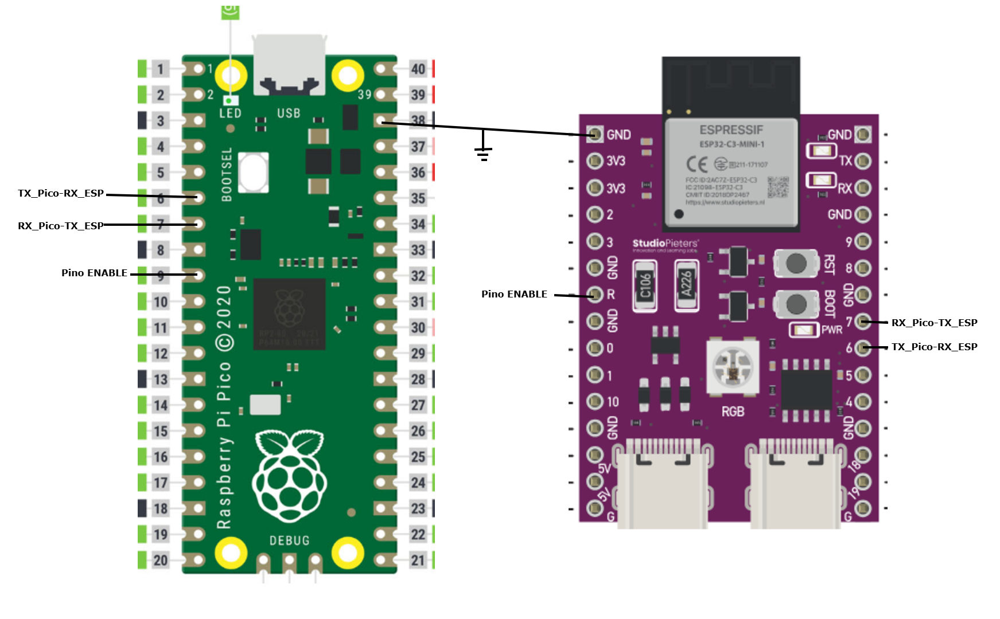

# ESP32-C3_AT-Communication_Pico2

Projeto de comunicação entre **Raspberry Pi Pico 2 (RP2350)** e **ESP32-C3-Mini-1** via comandos **AT** por UART.

O ESP32-C3 roda o firmware oficial **ESP-AT da Espressif** (v4.1.1.0) e funciona como módulo Wi-Fi/BLE controlado pelo Pico 2 através de comandos AT enviados por cabo serial.

---

## 🔧 Hardware Necessário

| Componente | Descrição |
|---|---|
| **Raspberry Pi Pico 2** | Microcontrolador RP2350 rodando MicroPython |
| **ESP32-C3-Mini-1** | Módulo Wi-Fi/BLE com firmware AT da Espressif |
| **Jumpers/Cabos** | Para conexão UART entre os dois módulos |

---

## 🔌 Conexões (Pinout)

```
  Pico 2                      ESP32-C3-Mini-1
  ┌──────────┐                ┌──────────────┐
  │ GP4 (TX) ──────────────▶  GPIO6 (RX)     │
  │ GP5 (RX) ◀──────────────  GPIO7 (TX)     │
  │ GP6      ──────────────▶  EN (Reset)     │
  │ GND ─────────────────────  GND            │
  │ 3V3(OUT) ────────────────  3V3            │
  └──────────┘                └──────────────┘
```



| Pico 2 | ESP32-C3-Mini-1 | Função |
|---|---|---|
| GP4 (UART1 TX) | GPIO6 (RX) | Dados Pico → ESP |
| GP5 (UART1 RX) | GPIO7 (TX) | Dados ESP → Pico |
| GP6 | EN | Reset hardware do ESP |
| GND | GND | Referência comum |
| 3V3(OUT) | 3V3 | Alimentação |

> ⚠️ **TX do Pico vai no RX do ESP e vice-versa** (conexão cruzada).

---

## 🚀 Como Usar

### 1. Gravar o Firmware AT no ESP32-C3-Mini-1

Baixe o firmware oficial: [ESP32-C3-MINI-1 AT v4.1.1.0](https://docs.espressif.com/projects/esp-at/en/latest/esp32c3/AT_Binary_Lists/esp_at_binaries.html)

Grave com `esptool`:

```bash
python -m esptool --chip esp32c3 --port COM7 --baud 460800 --before default-reset --after hard-reset write-flash --flash-mode dio --flash-freq 40m --flash-size 4MB 0x0 bootloader/bootloader.bin 0x8000 partition_table/partition-table.bin 0xd000 ota_data_initial.bin 0x1e000 at_customize.bin 0x1f000 customized_partitions/mfg_nvs.bin 0x60000 esp-at.bin
```

### 2. Instalar MicroPython no Pico 2

Baixe o firmware MicroPython para o Pico 2: [micropython.org](https://micropython.org/download/RPI_PICO2/)

### 3. Copiar os Arquivos para o Pico 2

Usando **Thonny**, **mpremote** ou a extensão **MicroPico** do VS Code, copie os arquivos `.py` para o Pico 2.

### 4. Executar

**Teste Wi-Fi:**

```bash
# No Thonny ou via mpremote
import main_wifi
```

**Teste BLE:**

```bash
import main_ble
```

---

## 📌 Comandos AT Úteis

| Comando | Descrição |
|---|---|
| `AT` | Teste de comunicação |
| `AT+GMR` | Versão do firmware AT |
| `AT+RST` | Reset por software |
| `AT+CWMODE=1` | Modo Station (cliente Wi-Fi) |
| `AT+CWJAP="ssid","pwd"` | Conectar ao Wi-Fi |
| `AT+CWLAP` | Listar redes disponíveis |
| `AT+CIFSR` | Ver IP atribuído |
| `AT+CIPSTART="TCP","host",port` | Abrir conexão TCP |
| `AT+CIPSEND=<len>` | Enviar dados |
| `AT+CIPCLOSE` | Fechar conexão |
| `AT+BLEINIT=2` | Iniciar BLE (Peripheral) |
| `AT+BLENAME="nome"` | Definir nome BLE |
| `AT+BLEADVSTART` | Iniciar advertising BLE |

📖 Documentação completa: [ESP-AT Command Set](https://docs.espressif.com/projects/esp-at/en/latest/esp32c3/AT_Command_Set/index.html)

---

## 🛠️ Tecnologias

- **MicroPython** v1.27.0 (RP2350)
- **ESP-AT Firmware** v4.1.1.0 (ESP32-C3)
- **esptool** v5.2.0

---

## 📝 Licença

MIT License

Copyright (c) 2026 Carlo Terzaghi Tuck Schneider

Permission is hereby granted, free of charge, to any person obtaining a copy
of this software and associated documentation files (the "Software"), to deal
in the Software without restriction, including without limitation the rights
to use, copy, modify, merge, publish, distribute, sublicense, and/or sell
copies of the Software, and to permit persons to whom the Software is
furnished to do so, subject to the following conditions:

The above copyright notice and this permission notice shall be included in all
copies or substantial portions of the Software.

THE SOFTWARE IS PROVIDED "AS IS", WITHOUT WARRANTY OF ANY KIND, EXPRESS OR
IMPLIED, INCLUDING BUT NOT LIMITED TO THE WARRANTIES OF MERCHANTABILITY,
FITNESS FOR A PARTICULAR PURPOSE AND NONINFRINGEMENT. IN NO EVENT SHALL THE
AUTHORS OR COPYRIGHT HOLDERS BE LIABLE FOR ANY CLAIM, DAMAGES OR OTHER
LIABILITY, WHETHER IN AN ACTION OF CONTRACT, TORT OR OTHERWISE, ARISING FROM,
OUT OF OR IN CONNECTION WITH THE SOFTWARE OR THE USE OR OTHER DEALINGS IN THE
SOFTWARE.