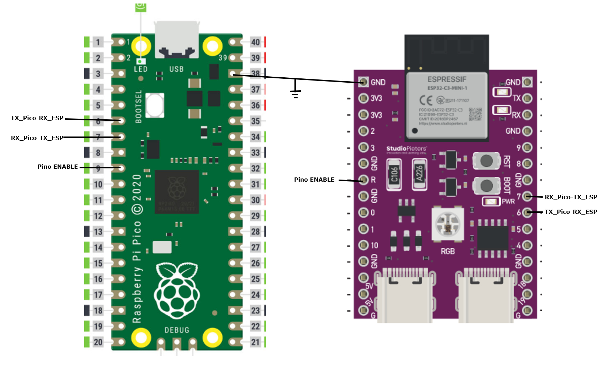

# ESP32-C3_AT-Communication_Pico2

Communication project between **Raspberry Pi Pico 2 (RP2350)** and **ESP32-C3-Mini-1** via **AT** commands over UART.

The ESP32-C3 runs the official **Espressif ESP-AT firmware** (v4.1.1.0) and works as a Wi-Fi/BLE module controlled by the Pico 2 through AT commands sent over serial.

---

## Features

- **Wi-Fi (STA):** connection, IP retrieval, HTTP GET requests
- **MQTT with mutual TLS:** connection to AWS IoT Core with client and server authentication (scheme 5), SNI and ALPN
- **Certificates via NVS:** writing `.der` certificates directly to the ESP32-C3 `mfg_nvs` partition via `AT+SYSMFG`, no external tools needed
- **BLE Peripheral:** advertising, GATT server, Write and Notify -- with LED control example via Web Bluetooth
- **SNTP:** time synchronization (required for TLS certificate validation)
- **Hardware reset:** EN pin controlled by the Pico to ensure a clean state on startup
- **AT Log (`AT+SYSLOG`):** detailed error codes for TLS/MQTT failure debugging
- **Zero external dependencies:** works with plain MicroPython, no additional libraries on the Pico

---

## Project Structure

```
lib/
└── esp32c3_at.py              # Main driver (ESP32C3_AT class)
examples/
├── wifi_simple_exemple.py     # Wi-Fi + HTTP GET example
├── ble_simple_exemple.py      # BLE Peripheral (advertising) example
├── ble_web_exemple/
│   ├── main_ble_led.py        # LED control via BLE + GATT server
│   └── index.html             # Web Bluetooth interface (HTML/CSS/JS)
└── mqtt_aws_exemple/
    ├── umqtt_test.py           # Mutual TLS MQTT for AWS IoT Core
    └── certs/                  # .der certificates (not versioned)
utils/
└── debug_uart.py              # UART diagnostic utility
```

---

## Required Hardware

| Component | Description |
|---|---|
| **Raspberry Pi Pico 2** | RP2350 microcontroller running MicroPython |
| **ESP32-C3-Mini-1** | Wi-Fi/BLE module with Espressif AT firmware |
| **Jumpers/Wires** | For UART connection between the two modules |

---

## Connections (Pinout)

```
  Pico 2                      ESP32-C3-Mini-1
  ┌──────────┐                ┌──────────────┐
  │ GP4 (TX) ──────────────▶  GPIO6 (RX)     │
  │ GP5 (RX) ◀──────────────  GPIO7 (TX)     │
  │ GP6      ──────────────▶  EN (Reset)     │
  │ GND ─────────────────────  GND            │
  │ 3V3(OUT) ────────────────  3V3            │
  └──────────┘                └──────────────┘
```



| Pico 2 | ESP32-C3-Mini-1 | Function |
|---|---|---|
| GP4 (UART1 TX) | GPIO6 (RX) | Data Pico → ESP |
| GP5 (UART1 RX) | GPIO7 (TX) | Data ESP → Pico |
| GP6 | EN | ESP hardware reset |
| GND | GND | Common ground |
| 3V3(OUT) | 3V3 | Power supply |

> **Pico TX goes to ESP RX and vice-versa** (crossover connection).

---

## How to Use

### 1. Flash the AT Firmware on the ESP32-C3-Mini-1

Download the official firmware: [ESP32-C3-MINI-1 AT v4.1.1.0](https://docs.espressif.com/projects/esp-at/en/latest/esp32c3/AT_Binary_Lists/esp_at_binaries.html)

Flash with `esptool`:

```bash
python -m esptool --chip esp32c3 --port COM7 --baud 460800 --before default-reset --after hard-reset write-flash --flash-mode dio --flash-freq 40m --flash-size 4MB 0x0 bootloader/bootloader.bin 0x8000 partition_table/partition-table.bin 0xd000 ota_data_initial.bin 0x1e000 at_customize.bin 0x1f000 customized_partitions/mfg_nvs.bin 0x60000 esp-at.bin
```

### 2. Install MicroPython on the Pico 2

Download the MicroPython firmware for the Pico 2: [micropython.org](https://micropython.org/download/RPI_PICO2/)

### 3. Copy the Files to the Pico 2

Using **Thonny**, **mpremote** or the **MicroPico** VS Code extension, copy the files to the Pico 2.

> **Important:** the driver must be placed in the `lib/` folder on the Pico so that
> `from lib.esp32c3_at import ESP32C3_AT` imports work correctly.

Minimum filesystem structure on the Pico:
```
/
├── lib/
│   └── esp32c3_at.py
└── <example>.py
```

### 4. Run

**Wi-Fi + HTTP GET Example:**

Copy `lib/esp32c3_at.py` (in the `lib/` folder) and `examples/wifi_simple_exemple.py` to the Pico 2:
```python
import wifi_simple_exemple
```
Connects to Wi-Fi, retrieves the local IP and performs an HTTP GET to `api.ipify.org` (returns the public IP).

**BLE Peripheral (advertising) Example:**

Copy `lib/esp32c3_at.py` and `examples/ble_simple_exemple.py` to the Pico 2:
```python
import ble_simple_exemple
```
Initializes BLE as `"Pico2-BLE"`, configures advertising with a visible name and waits for connections.

**BLE + LED via Web Bluetooth Example:**

Copy `lib/esp32c3_at.py` and `examples/ble_web_exemple/main_ble_led.py` to the Pico 2.
Open `index.html` in Chrome (via HTTPS or `localhost`) and connect via Web Bluetooth.
The page automatically discovers the GATT UUIDs and allows toggling the onboard LED (GP25)
with confirmation via Notify.

**MQTT Test with AWS IoT Core (mutual TLS):**

1. Copy the `.der` certificates to the `certs/` folder on the Pico filesystem.
2. Edit the parameters in `examples/mqtt_aws_exemple/umqtt_test.py`:
   ```python
   WIFI_SSID      = "your_network"
   WIFI_PASSWORD  = "your_password"
   AWS_HOST       = "abc123-ats.iot.us-east-1.amazonaws.com"
   MQTT_CLIENT_ID = "pico2_device"
   MQTT_TOPIC     = "your/topic"
   ```
3. Copy to the Pico 2: `lib/esp32c3_at.py` (in the `lib/` folder), `umqtt_test.py` and the `certs/` folder.
4. Run -- the script executes 6 steps automatically:
   - **Step 0:** Firmware diagnostics and NVS state
   - **Step 1:** Connect Wi-Fi + synchronize clock via SNTP
   - **Step 2:** Convert DER to PEM and write certificates to `mfg_nvs` via `AT+SYSMFG`
   - **Step 3:** Confirm IP and valid time before connection
   - **Step 4:** Configure mutual TLS MQTT (scheme=5) with SNI + ALPN and connect
   - **Step 5:** Publish binary payload via `AT+MQTTPUBRAW`

---

## Useful AT Commands

| Command | Description |
|---|---|
| `AT` | Communication test |
| `AT+GMR` | AT firmware version |
| `AT+RST` | Software reset |
| `AT+CWMODE=1` | Station mode (Wi-Fi client) |
| `AT+CWJAP="ssid","pwd"` | Connect to Wi-Fi |
| `AT+CWLAP` | List available networks |
| `AT+CIFSR` | View assigned IP |
| `AT+CIPSTART="TCP","host",port` | Open TCP connection |
| `AT+CIPSEND=<len>` | Send data |
| `AT+CIPCLOSE` | Close connection |
| `AT+BLEINIT=2` | Initialize BLE (Peripheral) |
| `AT+BLENAME="name"` | Set BLE name |
| `AT+BLEADVSTART` | Start BLE advertising |
| `AT+MQTTUSERCFG=0,5,"id","","",0,0,""` | Configure MQTT with mutual TLS (scheme=5) |
| `AT+MQTTSNI=0,"host"` | Set SNI for TLS |
| `AT+MQTTALPN=0,1,"x-amzn-mqtt-ca"` | Set ALPN (AWS IoT Core port 443) |
| `AT+MQTTCONN=0,"host",8883,0` | Connect to MQTT broker |
| `AT+MQTTPUB=0,"topic","msg",0,0` | Publish text message |
| `AT+MQTTPUBRAW=0,"topic",<len>,0,0` | Publish binary data |
| `AT+MQTTSUB=0,"topic",0` | Subscribe to MQTT topic |
| `AT+MQTTCLEAN=0` | Close MQTT connection |
| `AT+SYSMFG=2,"mqtt_ca","mqtt_ca",8,<len>` | Write CA certificate to NVS |
| `AT+CIPSNTPCFG=1,-3,"pool.ntp.org"` | Configure SNTP (BRT timezone) |
| `AT+SYSLOG=1` | Enable detailed AT log |

Full documentation: [ESP-AT Command Set](https://docs.espressif.com/projects/esp-at/en/latest/esp32c3/AT_Command_Set/index.html)

---

## Technologies

- **MicroPython** v1.27.0 (RP2350)
- **ESP-AT Firmware** v4.1.1.0 (ESP32-C3)
- **esptool** v5.2.0

---

## License

MIT License -- (c) 2026 Carlo Terzaghi Tuck Schneider. See [LICENSE](LICENSE).